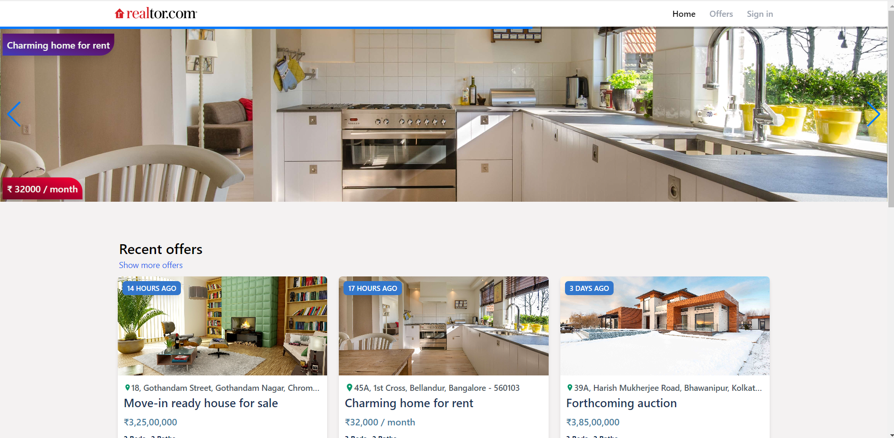
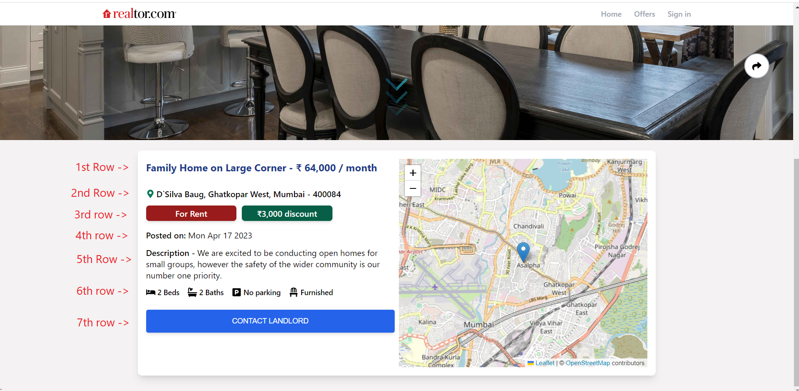
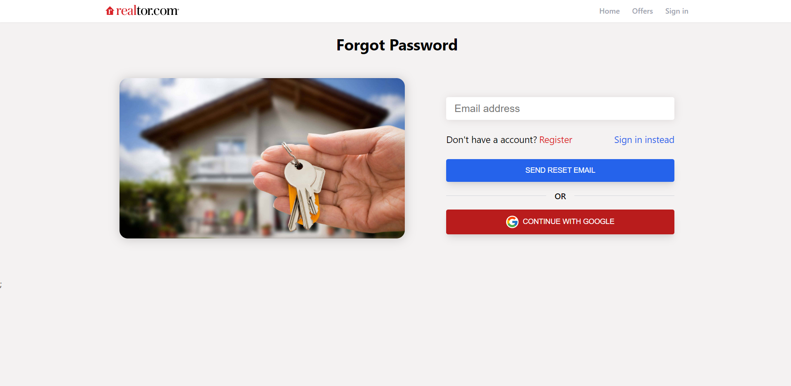

<br />
<p align="center"></p>
  <h1 align="center">Realtor</h1>
  <h3 align="center">Buy, Rent and Sell the house</h3>


  <p align="center">
    <a href="https://heliosbugtracker.azurewebsites.net/Tracker">View Demo</a>
  </p>
</p>

<p align="center">Universal online real estate market for everyone! Realtor app allows users to find there dream homes or rental properties, and it also allows users to list their properties for rent or sale.</p>

## ✨ Features

- Create a property listing
- Delete or edit listing property
- upload images of property
- Edit profile name
- Reset password
- separate pages for offer,rent and sale
- leaflet geolocation map
- Authentication using google service
- Fully responsive 
- Single page application 

## Tech Stack

| Stack    | -                                                                                                                                                                                 | -                                                                                                                                                                           | -                                                                                                | -                                                                                                                | -                                                                                                   |
| -------- | --------------------------------------------------------------------------------------------------                                                                                | -------------------------------------------------------------------------------------------------                                                                           | ------------------------------------------------------------------------------------------------ | ---------------------------------------------------------------------------------------------------------------- | --------------------------------------------------------------------------------------------------- |
| FrontEnd | <p align="center"> <br />Javascript</p>  | <p align="center"> <br />React Js</p>  | <p align="center"> <br />Sass</p>   | <p align="center"> <br />React Router</p>              | <p align="center"> <br />Swiper Js</p>
| BackEnd  | <p align="center"> <br />Firebase</p>     | <p align="center"> <br />Cloud Firestore</p> | <p align="center"> <br />Firebase Authentication</p> | <p align="center"> <br />Firebase Cloud Storage</p>               | <p align="center"> <br />Vercel</p> |


## :rocket: Quick start

### Installation
 <i>General requirement</i> - <br/>
  In order for those projects to work, you'll need to have: <br/>
  <ul>
  <li>
    An IDE of your choice, but I'd really recommand Visual Studio code. If you do not own it yet, take a look
    <a href="https://code.visualstudio.com/"> here </a>.
  </li>
  </ul>

### Step 1: Clone the repo
- Either clone the repo or download the app and open the folder in the cli
- To clone the repo locally by doing -
```sh
git clone https://github.com/Midhunkumar-se/realtor-react.git
```

### Step 2: Install dependencies
  - Install all dependencies using the `npm install` command
  - To do so, open your IDE, select the persistence Project and open the terminal, type `npm install` 

### Step 3: Setup firebase
- Go to firebase app, create a Firebase project and register your app
- Install the SDK and initialize Firebase, take a look at the documentation <a href="https://firebase.google.com/docs/web/setup"> here </a>.
- Don't use my `firebase.js` file, which is inside `src` folder, because my firebase configuration is different from yours, please read the documentation mentioned in 2nd point.
- Start the web server using the `npm start` command. The app will be served at http://localhost:3000/

#### And you are good to go


# Application presentation and flow:
## I - Home Page
When you visit the Realtor application, the first page you will directed to the home page of the application.


- If you do not have an account, you will be able to access the <b> home page </b>,<b> offer page</b>,<b> rent page</b>,<b> sale page</b>, and <b> sign-in page</b>. 
- On the home page header, you can see the app logo on the left side and three menus on the far right side - <b>home</b>,<b> offer</b>, and <b>sign-in</b>.
- If you have an account and logged in to that account, the <b>sign-in</b> option will be replaced with a <b>profile</b> option, which you will see later in this documentation.
- Below the menu header, There is a wide banner image along with the name of the respective house on the top left side of that image, and the cost of the respective house on the bottom left of that image. 
- If you click on that image, you will be redirected to the <b>listing page</b>(you will see later in this section) of that clicked image.

### Offers
- Below the banner image, you can see a list of <b> recent offers </b> house cards.
- If you click on <b>"Show more offers"</b> or <b>"offer"</b> (marked with a red border), you will be redirected to the offers page.
<kvb>
  
  
</kvb>

### Rent and sell category
- The same applies to the <b>"Places for Rent"</b> and <b>"Places for Sale"</b> sections located below the recent offers list in home page.
<kvb>
  
  
</kvb>
<kvb>
  
  
</kvb>

## II - Listing Page
- If you click one of the listed house cards in the application, you will be directed to the listed card detail page.
- On the top right of the image, you will see a <b>copy link button </b>(marked with a red border). You can click it to copy the URL of that listed page and share it on social media or other places.
- Below that image, you will see a <b>down arrow </b>(marked with a red border). Clicking on it will show you the details of the house and its location on the map.
<kvb>

  
</kvb>

### Details of listed house
<b>1st row</b> - Name of that house along with price of the house. </br>
<b>2nd row</b> - Address of that house. </br>
<b>3rd row</b> - First column is category whether house is for sale or rent 2nd column is dicount price. </br>
<b>4th row</b> - The date of the listed card was posted. </br>
<b>5th row</b> - Description of that house. </br>
<b>6th row</b> - Facilities of that house. </br>
<b>7th row</b> - Contact landlord button. </br>
<kvb>

</kvb>
- When you click that <b>7th row</b> button you will see landlord name in bold text and the house title in bold text, below that text area input and below text area input you see send message button (all marked in red border).
<kvb>

</kvb>

-When you click that send message button you will redirected to your default email provider in your system along with message you written in that text area and email of that landlord.

<kvb>

</kvb>

- Both authenticated and unauthenticated users can access the above features (both Home Page section and Listing Page section).
<br/>

## III - Authentication

Since the core application is protected through authentication and authorization,If you click <b>Sign in</b> link in header menu, you will directed to <b>Sign in</b> page. 
- If you do not have an account yet,go through registation process or you can use <b>Demo user email and password</b> which is below "continue with Google" button.
- And also you can register with your Gmail account.
<kbd>
  
  
</kbd>

### Forgot Password
If you forgot password click <b>forgot password</b> link in signIn Page or signUp Page you will directed to forgot password page.
- Write valid email on that input, A password reset link will be sent to your email to allow you to change your password.
<kbd>
  
  
  
  
  
  
</kbd>
<br/>

## III - Profile Page

After successfully logging in, you will be directed to the <b>home page</b>, and the <b>'Sign in'</b> link in the header menu will change to a <b>'Profile'</b> link.
<kbd>
  
</kbd>
- After clicking the <b>Profile</b> link, you will be directed to the <b>My Profile</b> page.
- On the profile page, you will see your name and email. Below that, you will find an edit link (which is used to edit your profile name) and a sign-out link (which is   used to log out from the application).
- Below the edit and sign-out links, you will see a <b>"Sell or Rent Your Home"</b> button, which you can use to create a listing.
- Below that button, you will find <b>"My Listings"</b>, which is a list of the house cards that you (the authenticated user) have created in the application.
 <kbd>
  
  
</kbd>

### Create Listing

After clicking <b>"Sell or rent your home"</b> button in profile page.
 <kbd>
  
</kbd><br/>

- You will be directed to <b>"Create Listing page"</b>.<br/>
<b>1st row</b> - Click the button according to whether you are going to sell or rent your house.</br>
<b>2nd row</b> - Enter the name.</br>
<b>3rd row</b> - Enter the number of bedrooms and bathrooms.</br>
<b>4th row</b> - Click the button to indicate whether a parking spot exists or not.</br>
<b>5th row</b> - Click the button to indicate whether the home is furnished or not.
<kbd>

</kbd>

<b>6th row</b> - Enter the address of the house.</br>
<b>7th row</b> - Enter the latitude and longitude of that address(in 6th row) you can find in Google map.</br>
<b>8th row</b> - Enter the description of the house.
<kbd>

</kbd>
<kbd>

</kbd> 

<b>9th row</b> - Click the button to indicate whether you will provide an offer. If you provide an offer, the <b>11th row</b> will appear; otherwise, it will not. <br/>
<b>10th row</b> - Regular price of your home. If you want to <b>rent</b> out your home, the <b>"\month"</b> will be displayed next to <b>regular price</b> input box.</br>
<b>11th row</b> - Discounted price of your home. If you want to <b>rent</b> out your home, the <b>"\month"</b> will be displayed next to <b>Discounted price</b> input box.</br>
<b>12th row</b> - Upload the images(maximun 6 and each image file size should be less than 2mb).</br>
<b>13th row</b> - Click this button to create a listing.</br>
<kbd>


</kbd>
<br/>
- Then you will redirected to you created <b>Listing page</b>
- And created house listing card add to <b>My Listing</b> in <b>Profile page</b>
<kbd>


</kbd>

### Delete Listing

In <b>'My Listing'</b> list you can <b>edit</b> and <b>delete</b> those listings.<br/>
- In <b>My Listing</b>, on the first row and second column card, you will see a delete button marked with a red border. It is located in the bottom left corner.<br/>
<kbd>

</kbd>
<br/>

- Clicking on that button you get warning alert "Are you sure want to delete?", if you click "Ok" button that house listing will be deleted.
<kbd>


</kbd>

### Edit Listing

In <b>My Listing</b> list you can <b>edit</b> and <b>delete</b> that listings. <br/>
- In <b>My Listing</b>, on the first row and third column card, you will see a <b>pencil</b> button marked with a red border. It is located in the bottom left corner.<br/>
<kbd>

</kbd>
<br/>

- Clicking on that button you will directed to <b>Edit Listing</b> page. <b>Edit Listing</b> process is exact same as <b>Create Listing</b>.
<kbd>


</kbd>

### Update profile

In <b>Profile Page</b> You see <b>edit</b> link below your email click that and your name input box color changes to red and you can edit your name and finally click apply change link to update profile name.
<kbd>


</kbd>

### Sign out

In <b>Profile Page</b> You see <b>sign out</b> link below your email click that link to logout from the application and you redirected to <b>home page</b>.
- In header menu <b>Profile</b> link changes to <b>Sign in</b> link.
<kbd>

  
</kbd>

  ##### And that wraps it up ! 
  
  ## Author

👤 **Midhun Kumar**

- Linkedin: [@Midhun Kumar](https://www.linkedin.com/in/midhun-kumar-30b108273/)
- Github: [@Midhun Kumar](https://github.com/Midhunkumar-se)

## Show your support

Please ⭐️ this repository if you liked the project!


